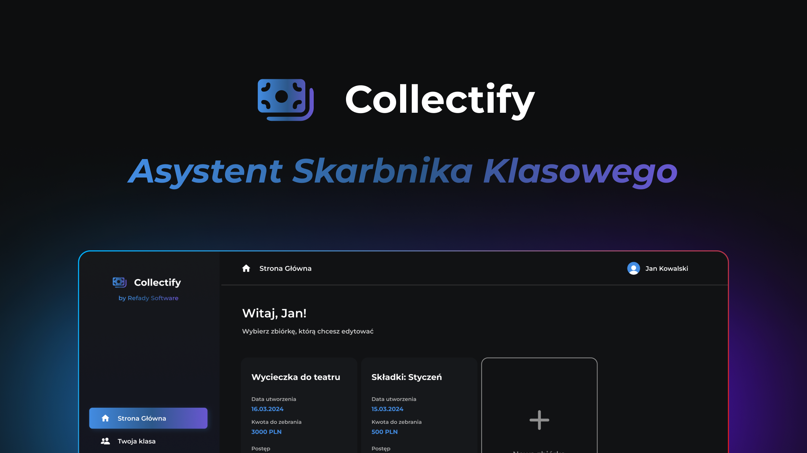

# Collectify Landing Page

Simple landing page for Collectify, a web application created for the purpose of collecting and organizing money.

## 🚀 Getting Started

1. Copy `.env.example` file and rename it to `.env`.
2. Clone the hygraph project to your account.
   [](https://app.hygraph.com/clone/d2ee26c3da644bb2b701941b53247105?name=Collectify)
3. Paste your hygraph project endpoint in the `.env` file.
4. Install dependencies.

```bash
pnpm install
```

5. Run development server.

```bash
pnpm dev
```

## 🔧 Tech stack

- [Astro](https://astro.build/)
- [React](https://react.dev/)
- [TypeScript](https://www.typescriptlang.org/)
- [Tailwind CSS](https://tailwindcss.com/)
- [pnpm](https://pnpm.io/)
- [Hygraph](https://hygraph.com/)
- [shadcn/ui](https://ui.shadcn.com/)

## 🚀 Deploying to Netlify

1. Install dependencies (Netlify will also run this):
   ```bash
   pnpm install
   ```
2. The site is configured for SSR using Netlify Functions via `@astrojs/netlify` adapter.
3. Build command: `pnpm build`
4. Publish directory: `dist`
5. (Automatic) Functions directory is managed by the adapter.

### Environment Variables

Create the variables in Netlify UI (Site settings → Environment variables) matching your local `.env` values (e.g. `HYGRAPH_ENDPOINT`). Re‑deploy after changes.

### Local Netlify Emulation (optional)

```bash
pnpm install -g netlify-cli
netlify dev
```

### Continuous Deployment

Connect your Git repository to Netlify and ensure the build settings match above. Each push to the configured branch triggers a deploy.
